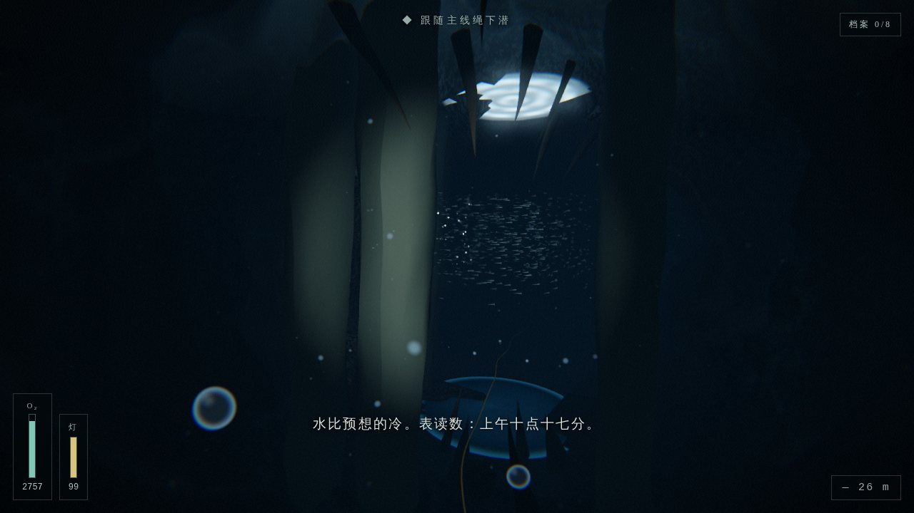
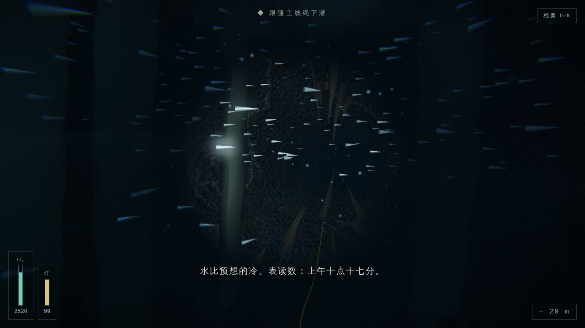
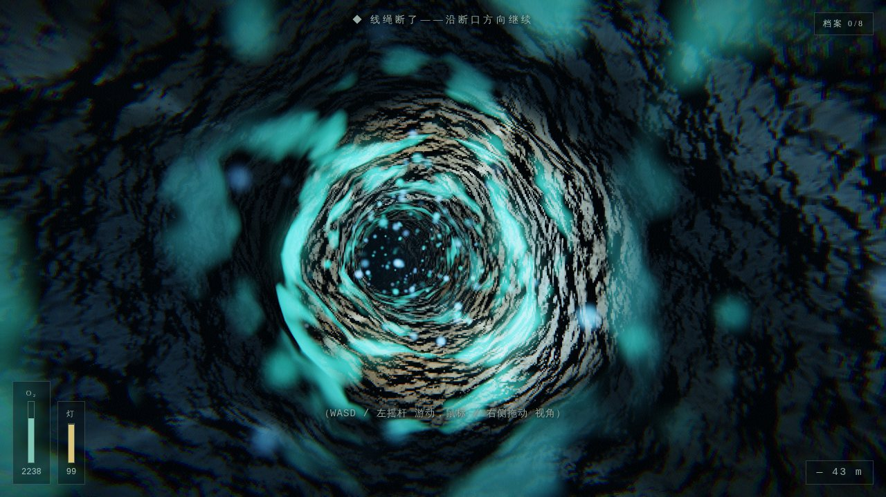
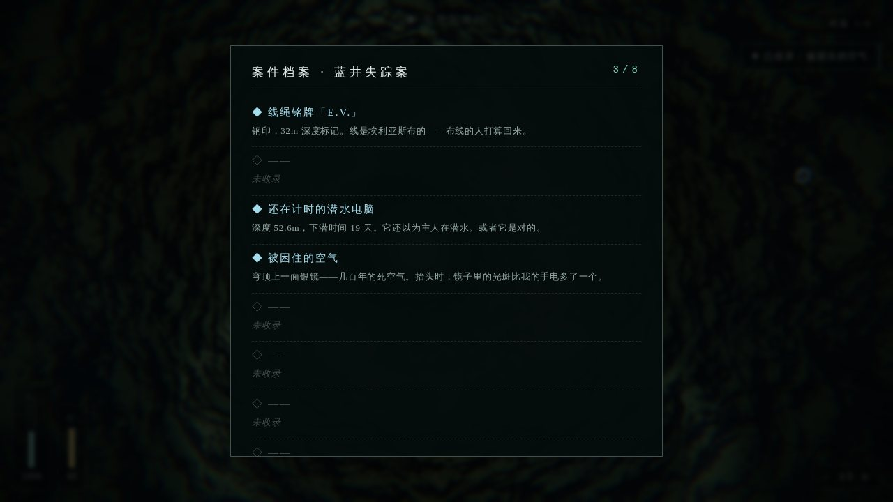

# DEEP DIVE ·《蓝井》

> 一次下潜 · 一宗悬案 · 一间红房间

**浏览器可玩 + Windows 便携 EXE** 的第一人称洞潜叙事恐怖游戏。狭窄通道、低能见度、
线绳导航、氧气与手电电量的决策压力，以及一路向下的方向迷失感。恐怖节奏取法
《遗传厄运》与《穆赫兰道》——长时间的不安铺垫、环境音渐变、灯光异常，惊吓只在铺垫
充分后出现一次；结局以《双峰》式的红房间与《极乐迪斯科》竹节虫式的「巨大而平静的非人之物」收束。

**全部资产程序化生成**：几何（噪声置换洞穴）、纹理（程序噪声 / Canvas）、音频（WebAudio 合成）。
零二进制素材、零版权风险。

| | | |
|---|---|---|
|  |  |  |
|  |  |  |
|  |  |  |

## 直接游玩（无需安装）

| 方式 | 路径 | 说明 |
|---|---|---|
| **Windows EXE** | [`release/DeepDive-win64.zip`](release/DeepDive-win64.zip)（≈2.4MB） | 解压后双击 `DeepDive.exe`。SmartScreen 提示时：更多信息 → 仍要运行 |
| **单文件网页** | [`release/web/DEEPDIVE.html`](release/web/DEEPDIVE.html) | 用 Chrome / Edge 直接双击打开，file:// 即可玩 |

EXE 为 Go 便携宿主：内嵌整个游戏（单文件 HTML），启动后只监听本机 `127.0.0.1`
随机端口，并用系统自带的 Edge/Chrome 以独立 App 窗口打开；关窗即退出，不写注册表、
不访问网络、无后台残留。重新打包：`npm run package:win`（需 go ≥ 1.22，Linux/macOS/WSL 可交叉编译）。

## 开发运行

```bash
npm install
npm run dev           # 本地游玩：http://localhost:5173
npm run build         # 常规构建 → dist/
npm run build:single  # 单文件构建（内联 JS/CSS）→ dist/index.html
npm run package:win   # 一键产出 Windows EXE + 单文件网页 → release/
```

要求 Node.js ≥ 18。建议佩戴耳机游玩，全程约 12–15 分钟。

## 操作说明

### 键盘 + 鼠标

| 按键 | 功能 |
|---|---|
| 鼠标 | 视角（点击画面锁定指针） |
| `W` `A` `S` `D` | 游动 |
| `Space` / `Shift` | 上浮 / 下潜 |
| `E` | 调查线索 / 互动 |
| `F` | 开关手电（有电量，关灯可缓慢回充） |
| `Tab` | 案件档案（已收录线索与批注） |
| `Esc` | 暂停菜单 |

### 触屏（手机 / 平板）

- **左侧虚拟摇杆**：游动；**右侧屏幕拖动**：视角
- **右下按钮**：`▲ 上浮`、`▼ 下潜`、`查看` 互动、`灯` 开关、`档` 案件档案

移动端自动检测并默认使用较低画质档位。

## 游戏内容

私家侦探受托调查失踪的职业洞潜员**埃利亚斯·凡恩**——他寄出的最后一件东西是一盘磁带：
四十分钟的水声，第三十九分钟，有人在水里说话。跟随他布设的主线绳潜入天坑「蓝井」。

- **一条完整可到达的结局**：深入 → 环境异常 → 有铺垫的惊吓 → 缺氧 → 深海生物的超现实
  显现 → 白光 → 红房间 → 致谢。由叙事推进自然触发，无隐藏操作。
- **8 条可调查线索**（铭牌 / 岩壁刻痕 / 潜水电脑 / 气室 / 面镜 / 录音记录仪 / 断绳 / 减压瓶站），
  `Tab` 打开案件档案查看侦探批注；部分线索有实际收益（减压瓶 +300 psi 氧）。
- **奇观时刻**：入口浅水焦散、穹顶大厅（晶柱阵 / 悬雾 / 深渊开口 / 头顶被困几百年的
  「气室银镜」）、绕柱洄游的鱼群风暴（闯入即银色爆散）、爆散后横穿穹顶的无声巨影、
  割绳之后的生物发光廊道——洞壁生物膜随你的动作漾开涟漪光波。
- **决策压力**：氧气随进度与用力消耗；手电常亮约 9 分钟耗尽（关灯回充）；贴底猛游会
  搅起泥雾、短暂糊掉能见度——教科书说：贴壁，慢。

## 画质档位

标题菜单与暂停菜单中可切换（运行时热切换）：

| 档位 | 像素比 | 泛光 | 洞壁细节/焦散 | 体积光 | 粒子 | 鱼群/光尘 |
|---|---|---|---|---|---|---|
| **高** | ≤2.0 + RT 4×MSAA | ✓ | ✓ | ✓ | 2600 | 700 / 900 |
| **中** | ≤1.5 | ✓ | ✓ | ✓ | 1200 | 450 / 600 |
| **低**（移动端默认） | 1.0 | ✗ | ✗ | ✗ | 500 | 180 / 260 |

## 技术架构

Vite + TypeScript + Three.js（WebGL2），无重型引擎，纯前端可静态部署。

```
src/
  core/
    noise.ts            种子随机 + Simplex 噪声 / fbm（一切程序化生成的基础）
    quality.ts          画质档位（含泛光/材质细节/鱼群密度开关）
    input.ts            统一输入：键鼠(指针锁) + 触控(虚拟摇杆/按钮/Tab 档案)
    audio.ts            程序化 WebAudio：drone/呼吸/心跳/金属声/stinger/钟簇/混响
  render/
    post.ts             合成管线：双通道泛光(亮通+1/4分辨率高斯) → ACES →
                        双模式色分级(深水/红房间) → 暗角/缺氧收缩/颗粒/闪光/淡入淡出
    caveMaterial.ts     洞壁材质注入：三平面细节法线、湿岩高光、岩层色带、方解石晶脉、
                        入口动画焦散、生物膜涟漪光波（平铺程序噪声纹理，无二进制资产）
    particles.ts        悬浮物(灯锥调制+扬泥增浊)与气泡池
    volumetric.ts       加性体积光锥与辉光精灵
  game/
    game.ts             总编排：渲染循环、状态机、debug 钩子
    story/
      cave.ts           程序化洞穴：路径+半径剖面+噪声置换、线绳、入口水膜/神光柱、8 线索道具
      spectacle.ts      奇观系统：晶柱阵/悬雾/深渊开口/气室银镜/鱼群风暴/巨影/廊道光尘
      script.ts         叙事节拍表(按进度 t 触发)与全部文本
      storyMode.ts      主逻辑：游动/氧气/电量/扬泥/档案/惊吓/缺氧/结局迁移
      creature.ts       深海生物（惊吓近脸 + 巨大发光两种形态）
      redroom.ts        红房间（波动帷幔×双层、镜面地板、镜像身影、环形吊灯、涟漪）
  ui/
    hud.ts              氧气/灯电量/深度/档案计数/收录通知/案件档案面板/字幕/介绍卡/致谢
    menu.ts             标题与暂停菜单
exe-host/               Go 便携宿主（Windows EXE：内嵌 HTML + 本机服务 + Edge app 窗口）
scripts/
  build-exe.sh          一键产出 release/DeepDive-win64.zip 与 release/web/DEEPDIVE.html
  e2e.mjs               Playwright 全流程端到端自测（26 项断言）
  capture.mjs           Playwright 关键节拍截图回归
docs/
  DESIGN.md             v0.1 设计文档：高概念、节拍表、架构、模拟模式扩展点
  UPGRADE_SPECTACLE.md  本轮升级设计：奇观/互动/EXE 的痛点对策与验收标准
```

### 核心机制

- **叙事按进度驱动**：玩家沿洞穴路径的归一化进度 `t ∈ [0,1]` 触发节拍表，保证每次惊吓前
  都有充分铺垫（灯光异常 ≥2 次、假指引灯、≥3 秒纯黑、心跳与叩击）。
- **碰撞**：玩家位置投影到路径采样点、按洞穴半径夹取——廉价稳定，适配任意噪声置换管壁。
- **渲染管线**：场景 → 线性 HDR RT → 亮通提取 → 1/4 分辨率两轮可分离高斯 → 合成 shader
  一次完成泛光叠加 / ACES / 显示空间双模式色分级 / 暗角 / 颗粒 / 闪光 / 淡入淡出。
- **材质注入**：`onBeforeCompile` 在 MeshStandardMaterial 上注入世界空间三平面细节法线与
  焦散/生物膜自发光——低模几何呈现湿岩微高光与动态光斑，且随画质档位热切换。
- **音频全程序化**：滤波噪声呼吸、双振荡器 drone、程序脉冲响应卷积混响、惊吓 stinger、
  玻璃钟簇（线索收录）等，均由 WebAudio 节点图实时合成。

## 「真实洞潜模拟模式」扩展点

架构已为第二模式预留（`src/game/modes.ts` 注册表 + `GameMode` 接口，标题菜单已有占位入口）。
规划见 `docs/DESIGN.md` §7：气体三分法则、放线导航、扬泥能见度模型（本轮已实装简化版）、
失误链。`StoryMode` 中叙事与机制已分层，模拟模式只需实现 `GameMode` 接口并注册。

## 自测脚本

```bash
npm i -D playwright && npx playwright install chromium
npm run build
node scripts/e2e.mjs        # 全流程 + 线索/档案/电量/鱼群断言（26 项）
node scripts/capture.mjs    # 关键节拍截图到 /tmp/dd-shots
```

游戏支持 `?debug=1` URL 参数，暴露 `window.__dd`（传送/触发事件/收录线索/查询状态）。

## 提示

- 含恐怖内容与闪光画面，请酌情游玩
- 桌面端 Chrome / Edge / Firefox / Safari 均可；WebGL2 必需
- 若无声音：浏览器要求用户手势后才能启动音频，点击任意按钮即可
