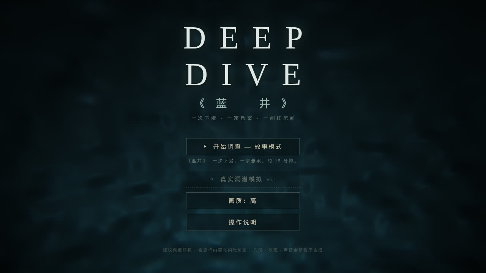
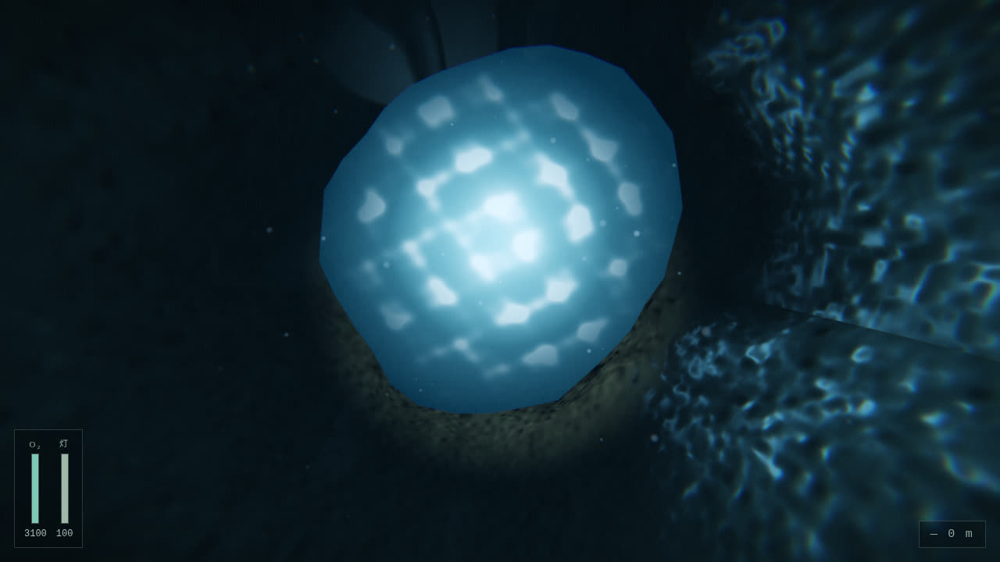
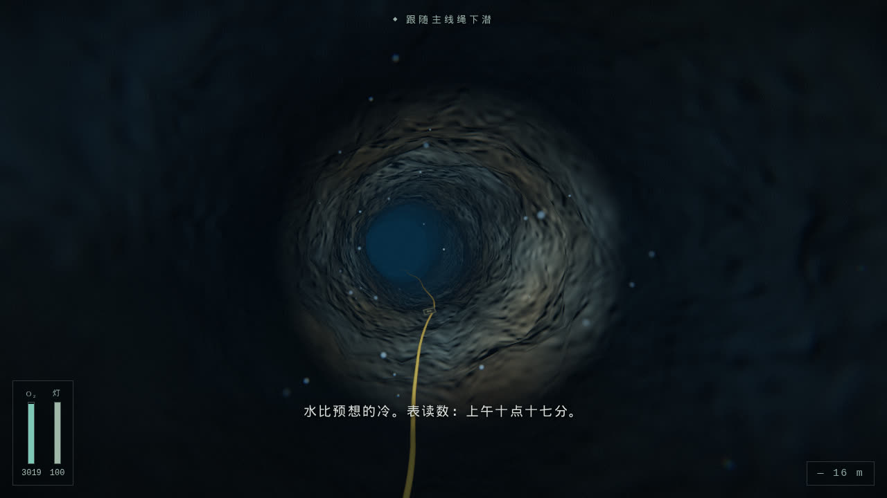
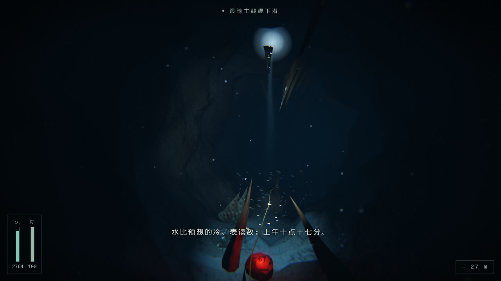
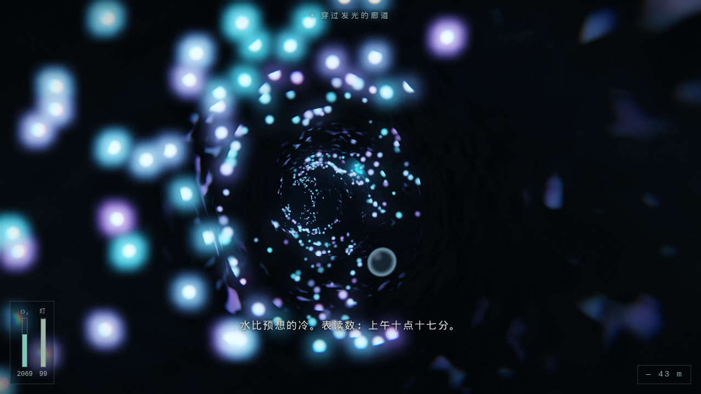
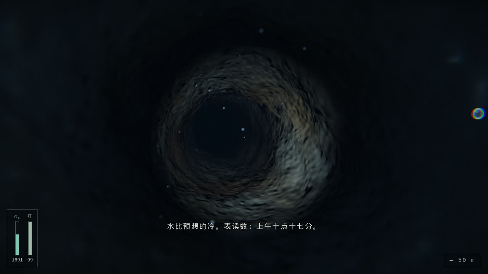
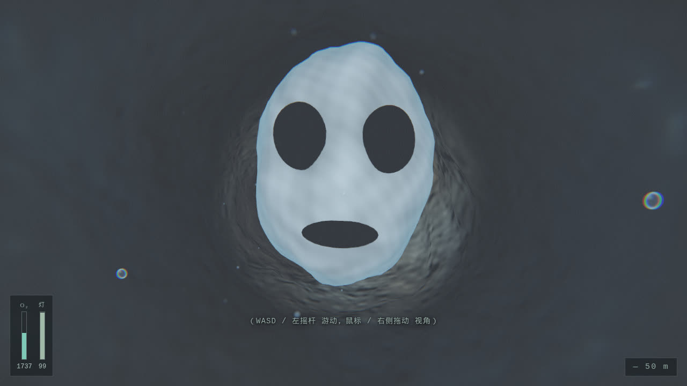
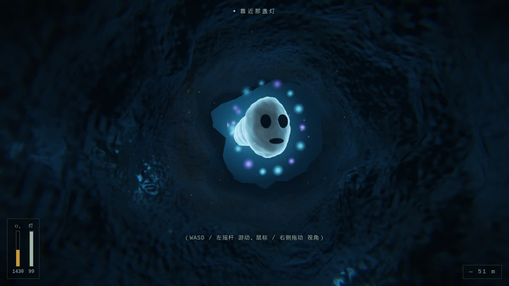
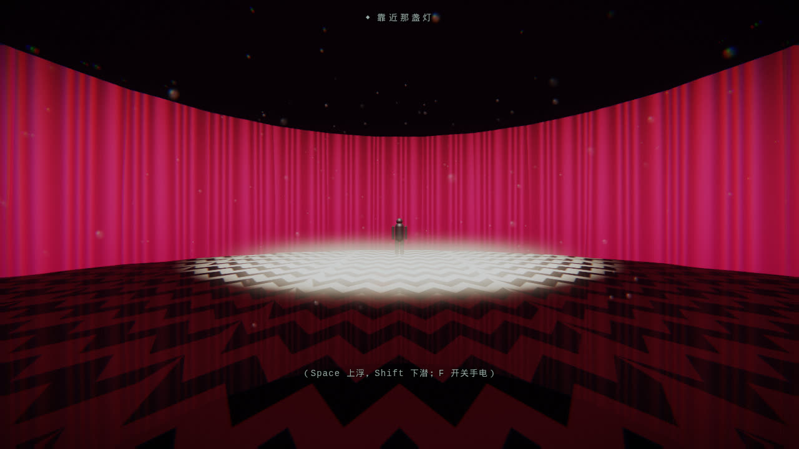

# DEEPDIVE ·《蓝井》

> 一次下潜 · 一宗悬案 · 一间红房间

浏览器可玩、亦提供 **Windows 便携 EXE** 的**洞潜 / 深海洞穴调查**叙事恐怖游戏。第一人称洞潜体验：狭窄通道、低能见度、导引绳、氧气与手电电量管理、方向迷失感。恐怖节奏取法《遗传厄运》与《穆赫兰道》——长时间的不安铺垫、环境音渐变、灯光异常，中途穿插**壮美奇观**（穹顶天光、银鱼漩涡、生物发光廊道），最后以超现实的「红房间」收束（《双峰》/《极乐迪斯科》式点睛）。

**全部资产程序化生成**：几何（噪声置换洞穴）、纹理与微表面（GLSL 注入）、音频（WebAudio 合成）。零外部素材、零版权风险。

| | | |
|---|---|---|
|  |  |  |
|  |  |  |
|  |  |  |

## Windows EXE（下载即玩）

仓库内已包含打包好的便携版：

1. 下载 [`release/DeepDive-win32-x64.zip`](release/DeepDive-win32-x64.zip)（约 96 MB）
2. **完整解压**整个文件夹（勿只复制 exe），双击 `DeepDive.exe`
3. 若 Windows SmartScreen 提示「已保护你的电脑」：点「更多信息」→「仍要运行」

无网页服务器环境也可玩单文件版：下载 [`release/DeepDive-web.html`](release/DeepDive-web.html)（<1 MB），用 Chrome/Edge 直接打开。

本地一键重新打包（Linux/macOS 即可产出 Windows 包，无需 Wine）：

```bash
npm install
npm run package:win     # 产出 release/DeepDive-win32-x64.zip
npm run build:single    # 产出 dist-single/index.html（单文件网页版）
```

## 快速开始（网页版）

```bash
npm install
npm run dev      # 本地游玩：http://localhost:5173
npm run build    # 产物输出到 dist/
npm run preview  # 预览构建产物
```

要求 Node.js ≥ 18。建议佩戴耳机游玩，全程约 12–15 分钟。

## 操作说明

### 键盘 + 鼠标

| 按键 | 功能 |
|---|---|
| 鼠标 | 视角（点击画面锁定指针） |
| `W` `A` `S` `D` | 游动 |
| `Space` / `Shift` | 上浮 / 下潜 |
| `E` | 调查线索 / 互动 |
| `F` | 开关手电（**有电量**，耗尽前会闪烁变暗；关灯省电，且黑暗中更能看清生物发光） |
| `N` | 侦探笔记（已发现线索图鉴 + 案情推理） |
| `Esc` | 暂停菜单 |

### 触屏（手机 / 平板）

- **左侧虚拟摇杆**：游动
- **右侧屏幕拖动**：视角
- **右下按钮**：`▲ 上浮`、`▼ 下潜`、`E 互动`、`灯` 开关、`N 笔记`

移动端会自动检测并默认使用较低画质档位。

## 游戏内容

你是一名私家侦探，受托调查失踪的洞穴潜水员 K。线索指向一处淡水天坑「蓝井」。跟随主线导引绳下潜，沿途发现前人遗留的线索，直到你也看见 K 最后看见的东西。

**一条完整可到达的结局**：深入 → 环境异常（回声、灯光闪烁、导引灯熄灭）→ 有铺垫的惊吓 → 缺氧 → 深海生物的超现实显现 → 白光 → 红房间 → 致谢。结局由叙事推进自然触发，不需要任何隐藏操作。

### 奇观时刻（不只有惊吓）

- **井口仰望**：出生即悬浮于竖井中，头顶是摇曳的镜面水盘与倾泻而下的天光焦散
- **钟厅天光**：巨大穹顶大厅，一柱阳光从顶部裂缝直插深渊，**银色鱼群**绕光柱盘旋成漩涡，靠近会四散奔逃
- **生物发光廊道**：洞壁覆满青色水螅体光点；**关掉手电**，黑暗中它们成倍增亮；游近时激起一圈圈光波涟漪
- **深海生物显现**：缺氧幻觉中，庞然巨物携一身荧光灯列缓缓逼近——敬畏而非惊吓
- **红房间逆浮水珠**：结局幕布间，无数暗红水珠违背重力缓缓上升

### 可互动线索（8 处 + 侦探笔记）

沿途 `E` 键调查：K 的相机、割断的绳头、脚蹼、**接力气瓶（可补氧，风险决策）**、岩壁刻痕、水螅体簇、写字板、漂浮残物……每条线索录入 `N` 键**侦探笔记**，集齐可拼出 K 失踪的完整案情。

### 玩法博弈

- **氧气**：深度越深耗氧越快；接力气瓶可补氧但要偏离主绳
- **手电电量**：开灯耗电、见底前闪烁变暗；关灯省电且能看见生物发光，但黑暗中更容易恐慌
- **导引绳**：离绳探索有迷失风险，绳是回家的路

## 画质档位

标题菜单与暂停菜单中可切换：

| 档位 | 内容 |
|---|---|
| **高** | 全分辨率、完整后处理（Bloom 辉光/水下扰动/色差/颗粒/暗角/色分级）、体积光锥、湿岩焦散微表面、高密度粒子/鱼群/水螅体 |
| **中** | 0.85× 渲染比例、精简 Bloom 与粒子、鱼群/水螅体减半 |
| **低**（移动端默认） | 0.7× 渲染比例、关闭 Bloom/体积光锥/色差、最小粒子与鱼群 |

## 技术架构

Vite + TypeScript + Three.js（WebGL2），无重型引擎，纯前端可静态部署；Electron 仅作桌面壳。

```
src/
  main.ts               入口
  core/
    noise.ts            种子随机 + Simplex 噪声 / fbm（一切程序化生成的基础）
    quality.ts          画质档位定义与设备自动检测（Bloom/焦散/鱼群/水螅体/水珠数量分档）
    input.ts            统一输入层：键鼠(指针锁定) + 触控(虚拟摇杆)
    audio.ts            程序化 WebAudio 引擎：drone/呼吸/心跳/金属声/stinger/混响
  render/
    post.ts             后处理：多通道高斯 Bloom + 单通道合成（水下扰动、ACES、色分级、暗角、颗粒、闪光、淡入淡出）
    particles.ts        悬浮物(灯锥调制)与气泡池
    volumetric.ts       加性体积光锥（支持近相机淡出）与辉光精灵
  game/
    game.ts             总编排：渲染循环、状态机(菜单/过场/游玩/暂停/笔记)、debug 钩子
    modes.ts            模式注册表（故事模式 + 模拟模式扩展点）
    story/
      cave.ts           程序化洞穴：Catmull-Rom 路径 + 噪声置换管壁；岩层分色/湿润微表面/焦散/生物膜
                        的 GLSL 注入；井口水面盘、钟厅天光竖井、导引绳、线索、碰撞采样
      fauna.ts          程序化动物群：银鱼群(实例化+盘旋/避人)、水螅体光点阵(近距光波)
      script.ts         叙事数据：节拍表(按进度 t 触发)、台词、介绍卡、致谢
      storyMode.ts      故事模式主逻辑：游动物理/氧气/手电电量/节拍触发/惊吓/缺氧/结局迁移
      creature.ts       深海生物（惊吓近脸 + 巨大发光两种形态，自定义皮肤 shader + 荧光冠冕）
      redroom.ts        红房间结局场景（波动幕布 shader、V 形纹地板、剪影人物、逆浮水珠）
  ui/
    hud.ts              氧气表/深度计/电量条/字幕/目标提示/介绍卡/侦探笔记/致谢
    menu.ts             标题与暂停菜单
electron/               桌面壳（main.cjs / preload.cjs）
docs/
  DESIGN.md             设计文档：高概念、节拍表、技术架构、扩展点
  UPGRADE_SPECTACLE.md  本轮冲击力升级设计：奇观/互动/视觉提升项/EXE 方案
scripts/
  package-win.cjs       一键打包 Windows 便携 EXE（下载 Electron→注入 dist→裁剪→zip）
  capture.mjs           Playwright 截图自测（可选）
  e2e.mjs               Playwright 全流程端到端自测（可选）
```

### 核心机制

- **叙事按进度驱动**：玩家沿洞穴路径的归一化进度 `t ∈ [0,1]` 触发节拍表（雾色渐变、音效、灯光异常、目标更新、惊吓序列启动），保证每次惊吓前都有充分铺垫。
- **碰撞**：把玩家位置投影到路径采样点，按该处洞穴半径夹取——廉价且稳定，适配任意噪声置换的管壁；井口竖井区放开约束允许自由仰泳。
- **渲染管线**：场景渲染到线性 HDR RenderTarget → 亮部提取 + 1/4 分辨率可分离高斯 Bloom → 合成 shader 完成扰动 → ACES 色调映射 → gamma → 显示空间色分级 → 暗角/颗粒/闪光/淡入淡出。
- **岩壁材质**：`MeshStandardMaterial` 经 `onBeforeCompile` 注入——世界空间三平面微法线、按顶点湿润度调制粗糙度/反光、上表面动画焦散、廊道区生物膜自发光，全程序化无贴图。
- **音频全程序化**：滤波噪声呼吸声、双振荡器 drone、程序脉冲响应卷积混响、惊吓 stinger（下滑锯齿 + 噪声爆发）等，均由 WebAudio 节点图实时合成。

## 「真实洞潜模拟模式」扩展点

架构已为第二模式预留（`src/game/modes.ts` 注册表 + `GameMode` 接口，标题菜单已有占位入口）。规划见 `docs/DESIGN.md`，要点：

- 复用：洞穴生成器（换参数/换种子）、游动物理、输入、渲染管线、音频引擎
- 新增：气体规划（三分之一法则、多瓶切换）、真实浮力/配重/微调、淤泥扬起致零能见度、沿绳摸黑折返、减压停留
- `StoryMode` 中叙事与机制已分层（`script.ts` 数据驱动），模拟模式只需实现 `GameMode` 接口并注册即可

## 自测脚本（可选）

```bash
npm i -D playwright && npx playwright install chromium
npm run build
node scripts/e2e.mjs        # 全流程：标题→探索→惊吓→缺氧→生物→红房间→致谢→返回菜单
node scripts/capture.mjs    # 关键节拍截图到 /tmp/dd-shots
```

游戏支持 `?debug=1` URL 参数，暴露 `window.__dd`（传送/触发事件/查询状态），供自动化测试使用。

## 提示

- 含恐怖内容与闪光画面，请酌情游玩
- 桌面端 Chrome / Edge / Firefox / Safari 均可；WebGL2 必需
- 若无声音：浏览器要求用户手势后才能启动音频，点击任意按钮即可
